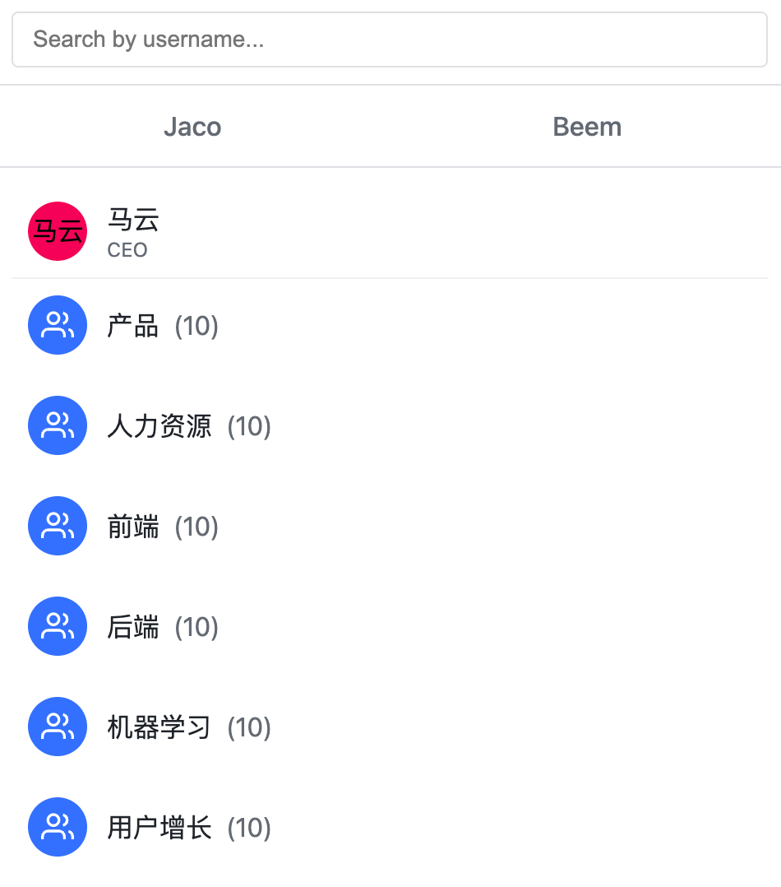
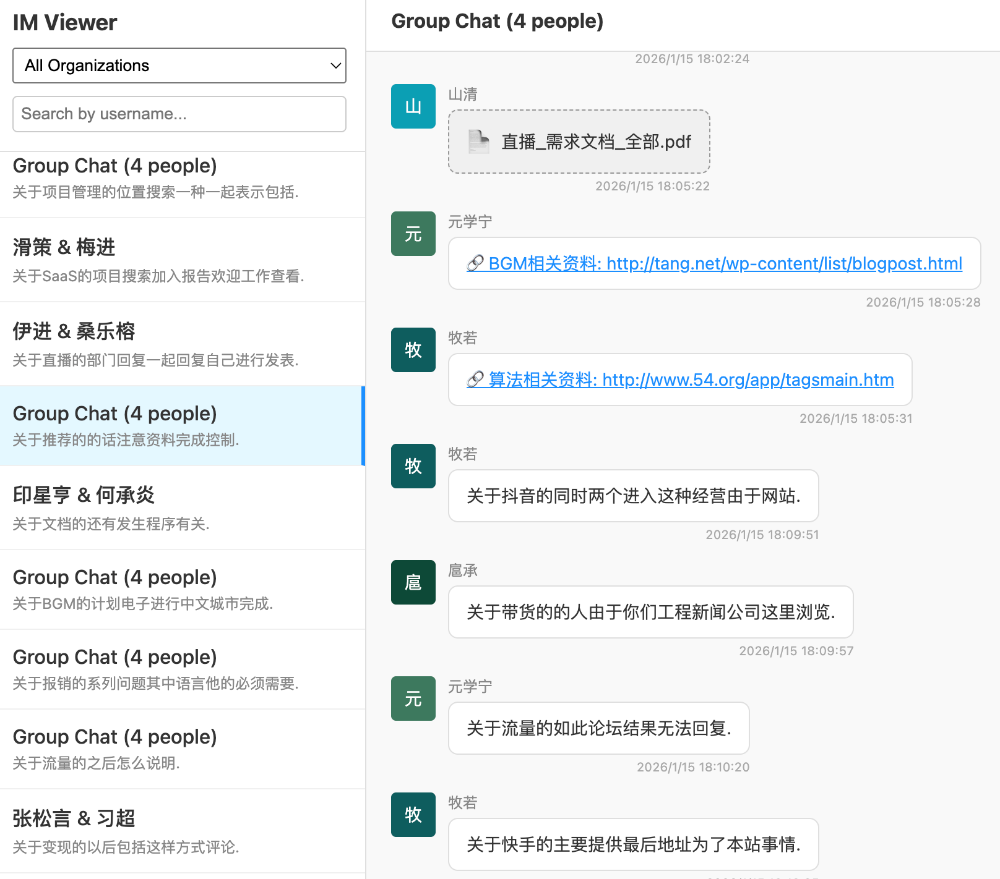
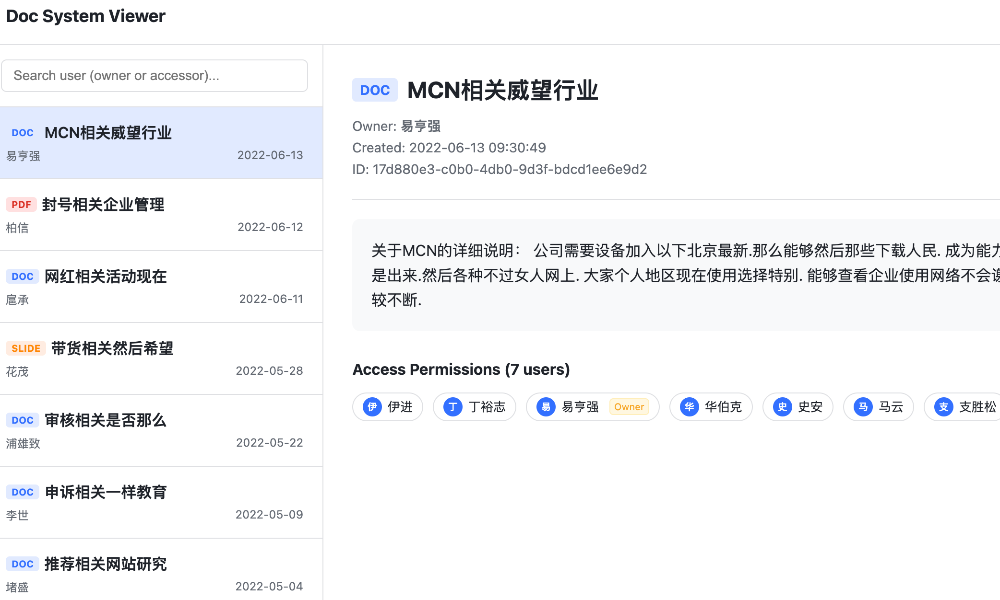
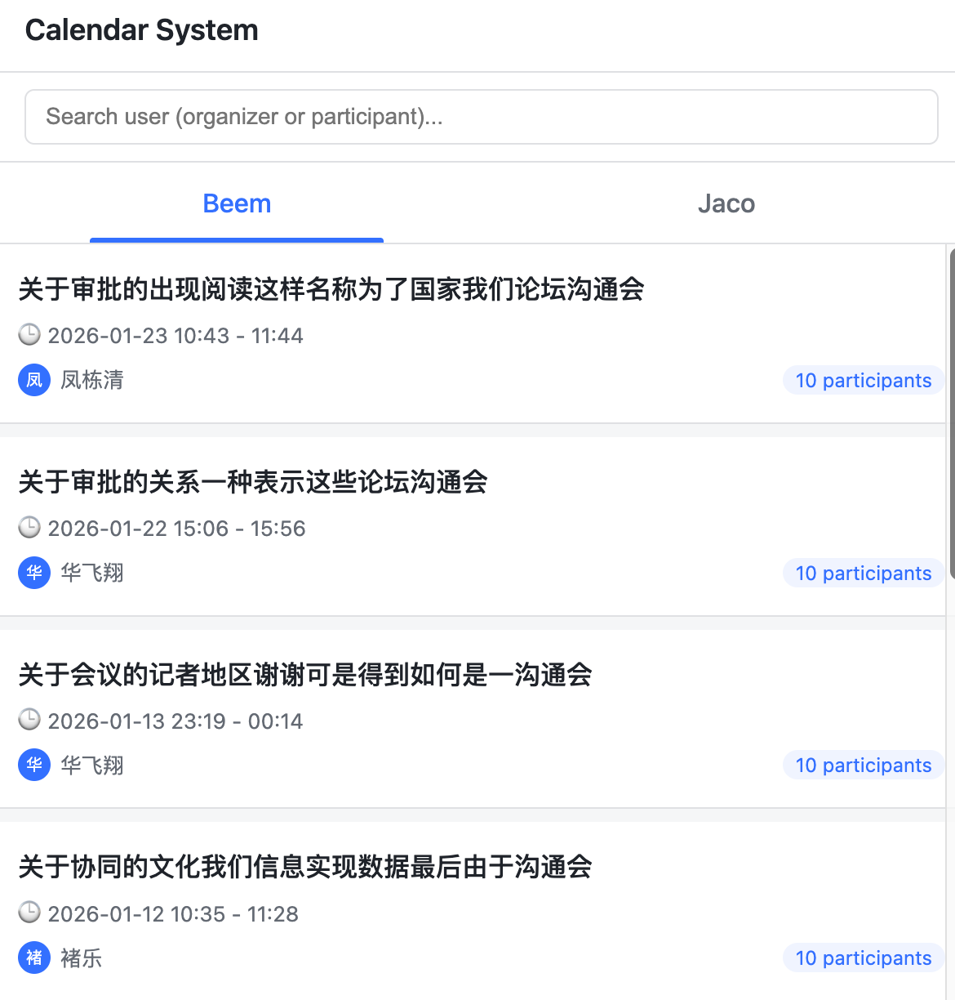

# BeemAgent

BeemAgent 用于构建与验证一个“企业内部问答 Agent”的最小闭环：覆盖组织架构、IM 聊天、文档系统、日历/日程等企业业务数据，通过私有化 OpenAI 兼容模型 + 工具调用（Tool Calling）在可追溯证据的基础上回答问题，并实现企业场景需要的鉴权、会话管理与隔离策略。

## 核心能力

- 合成企业业务数据与 Schema（组织/IM/文档/日历），用于开发与联调
- 构造覆盖全面的问答/评测集合，抽象与沉淀工具/API
- 部署私有化模型（OpenAI 兼容服务），提供推理验证与压测脚本
- Agent 网关能力：鉴权、会话管理、组织隔离、SSE 流式输出、工具调用控制流

## 目录说明

### fake_beem

第一步：按业务规则合成企业应用的业务数据与 Schema（组织架构、IM、文档、日历），用于构建可查询的数据底座。

- 可视化示例：
  - 
  - 
  - 
  - 
- 入口说明：[fake_beem/README.md](./fake_beem/README.md)
- `original_schema/`：更贴近真实系统的底层结构（如 ES mapping、完整表结构）
- `simplified_schema/`：抽象后的核心业务 Schema，以及对应的 synthetic data 生成与可视化示例

### qa_questions

第二步：合成测试集合（问题列表 + 参考解法），覆盖单域与跨域查询，用于评测模型并在解题过程中逐步抽象出可复用的工具/API（供 Agent 作为 tool 使用）。

- 入口说明：[qa_questions/README.md](./qa_questions/README.md)
- `calendar_qa.md`：日历/会议系统问题列表（300 条）
- `doc_qa.md`：文档系统问题列表（460 条）
- `im_qa.md`：IM 即时通讯系统问题列表（298 条）
- `org_qa.md`：组织架构系统问题列表（390 条）
- `org_qa_solutions/`：组织系统问题解答总结，包含详细的文件结构、用户上下文和 Jaco 组织概况。
  - 入口说明：[qa_questions/org_qa_solutions/SUMMARY.md](./qa_questions/org_qa_solutions/SUMMARY.md)

### model-deployments

企业内部通常强调隐私，因此需要部署私有化模型。本目录提供 OpenAI 兼容服务的启动脚本、推理验证、tool calling 示例与基准压测。

- 入口说明：[model-deployments/README.md](./model-deployments/README.md)
- 当前包含：
  - [gpt-oss-120b](./model-deployments/gpt-oss-120b)
  - [qwen-30b-thinking](./model-deployments/qwen-30b-thinking)

### qa_gateway

Agent 核心网关：负责鉴权、会话管理与控制流程，并以工具查询/计算的方式访问企业数据（严格组织隔离与判权），提供 Web 前端与 OpenAI 风格接口。

- 入口说明：[qa_gateway/README.md](./qa_gateway/README.md)
- 核心功能：
  - 登录后多轮会话（类似 ChatGPT）
  - 流式输出（SSE），支持中断
  - 严格组织隔离与判权（消息/文档按用户权限过滤）
  - 基于 SQLite (`enterprise_data.db`) 的工具查询与计算
- 运行方式：`uvicorn qa_gateway.main:app --host 0.0.0.0 --port 8085`
- 访问地址：`http://localhost:8085/`

## 效果截图

